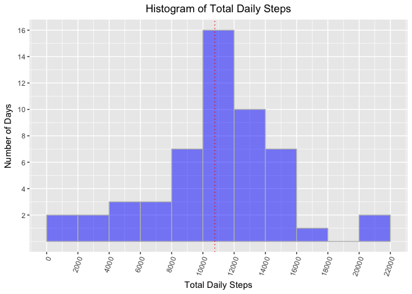
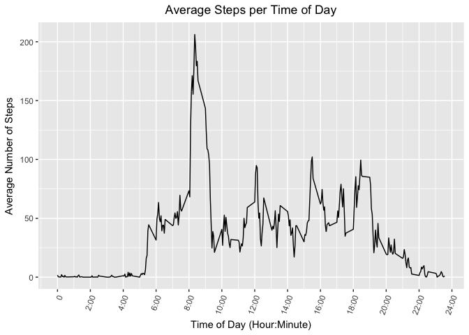
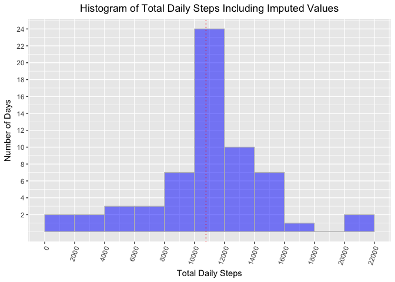
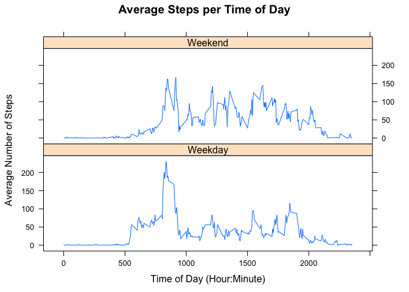

# Analysis of Daily Human Step Activity
inlbk  
March 28 , 2017  


## Overview


It is now possible to collect a large amount of data about personal movement using activity monitoring devices such as a Fitbit, Nike Fuelband, or Jawbone Up. These type of devices are part of the “quantified self” movement – a group of enthusiasts who take measurements about themselves regularly to improve their health, to find patterns in their behavior, or because they are tech geeks. But these data remain under-utilized, both because the raw data are hard to obtain and because there is a lack of statistical methods and software for processing and interpreting the data.

This analysis makes use of data from a personal activity monitoring device that collects information at 5 minute intervals throughout the day. The data consists of two months of information from an anonymous individual collected during the months of October and November, 2012 and includes the number of steps taken during each 5 minute interval. The data is stored in a comma-separated-value (CSV) file containing a total of 17,568 observations that can be found at the following URL:

- Activity monitoring data [52K]:  https://d396qusza40orc.cloudfront.net/repdata%2Fdata%2Factivity.zip

The variables included in the dataset are:

- steps: Number of steps taking in a 5-minute interval (missing values are coded as NA).

- date: The date on which the measurement was taken in YYYY-MM-DD format.

- interval: Identifier for the 5-minute interval in which the measurement was taken.

The analysis addresses the following questions:

1. What is the mean total number of steps taken per day?

2. What is the average daily activity pattern?

3. What is the impact of imputing missing data on the estimates of the total daily number of steps?

4. Are there differences in activity patterns between weekdays and weekends?

## Loading and preprocessing the data


```r
# Load packages and set random number seed.
library(plyr)
library(dplyr)
library(ggplot2)
library(Hmisc)
library(lattice)
set.seed(5678)
options(scipen=10, digits=2)
```

The data, located at the following URL, is downloaded and read, and the date on which the download occurred is recorded.


```r
# Download the zip file and read in the data.
fileUrl<- "https://d396qusza40orc.cloudfront.net/repdata%2Fdata%2Factivity.zip"
destfile<-"activity.zip"
if(!file.exists("activity.zip")){
      download.file(fileUrl, destfile, method="curl")
} 
if(!exists("rawsteps")) {
      rawsteps <- read.csv(unz("activity.zip", "activity.csv"),header=TRUE,
                           na.strings=c("NA",""))
}
# Record the date of the download and list the variable names.
dateDownloaded <- date()  
dim(rawsteps)
```

```
## [1] 17568     3
```

```r
names(rawsteps)
```

```
## [1] "steps"    "date"     "interval"
```

The date field is converted to standard date format, and the total number of unique days is determined.   There are 61 unique dates in the dataset, which is as expected (October has 31 days and November has 30 days). Thus each date is represented in the dataset. Furthermore, there are 17,568 observations in all, which is consistent with 61 days of observations and 288 observations per day (24*60 minutes per day / 5 minutes per interval), hence there are no missing rows. 

```r
# Change date field to standard date format.
rawsteps[,2] <- as.Date(rawsteps[,2])
length(unique(rawsteps$date))   #Number of unique dates in the dataset
```

```
## [1] 61
```

## What is the mean total number of steps taken per day?

To determine the average steps taken per day, the data is aggregated by date. The resulting tallies show that there are eight days with no data (October 1 and 8; November 1, 4, 9, 10, 14, and 30). There is also a wide range of daily steps, including 126 steps on October 2, 41 steps on November 15, and 21,194 steps on November 23.  Since it is unlikely that a person could only take 41 or 126 steps in a 24-hour period, a follow-up investigation to determine whether on some days the number of steps taken was not accurately recorded is recommended.


```r
# Determine which days have one or more NA's
unique(rawsteps[is.na(rawsteps[,1]),2])
```

```
## [1] "2012-10-01" "2012-10-08" "2012-11-01" "2012-11-04" "2012-11-09"
## [6] "2012-11-10" "2012-11-14" "2012-11-30"
```

```r
# Sum the total number of steps by date.
stepsbydate <- aggregate(steps~date,data=rawsteps,FUN=sum)
head(stepsbydate)
```

```
##         date steps
## 1 2012-10-02   126
## 2 2012-10-03 11352
## 3 2012-10-04 12116
## 4 2012-10-05 13294
## 5 2012-10-06 15420
## 6 2012-10-07 11015
```

```r
# Find range of daily step totals.
min(stepsbydate[,2]); max(stepsbydate[,2])
```

```
## [1] 41
```

```
## [1] 21194
```


```r
# Determine the mean and median number of steps per day.
dailymean<-mean(stepsbydate$steps);dailymean
```

```
## [1] 10766
```

```r
dailymedian<-median(stepsbydate$steps);dailymedian
```

```
## [1] 10765
```

```r
# Create histogram of the total daily steps.
ggplot(stepsbydate, aes(stepsbydate$steps))+geom_histogram(col="gray",
      fill="blue",alpha=.5,binwidth=2000,center=1000)+theme(axis.text.x = 
      element_text(hjust=1, angle=70),plot.title = element_text(hjust = 
      0.5))+ggtitle("Histogram of Total Daily Steps")+xlab("Total Daily Steps")+ 
      ylab("Number of Days")+scale_y_continuous(breaks=c(2,4,6,8,10,12,14,16))+
      scale_x_continuous(breaks=c(0,2000,4000,6000,8000,10000,12000,14000,
                                  16000,18000,20000,22000,24000))+
      geom_vline(xintercept=dailymedian, linetype="dotted",col="red")
```

<!-- -->

The histogram above shows that the most frequently occurring daily step total is between 10,000 and 12,000 steps. The mean number of steps taken per day is 10766.19 and the median number of steps taken per day is 10765, as indicated by the red dashed line in the histogram.


## What is the average daily activity pattern?

The average number of steps taken during each 5-minute time interval in the day is plotted below.  The maximum activity is 206 steps, occurring at 8:35 a.m. 


```r
# Remove observations with NA's.
cleansteps <- rawsteps[!is.na(rawsteps$steps),]
dim(cleansteps)
```

```
## [1] 15264     3
```

```r
# Calculate average number of steps in each 5-minute interval.
intervalmeans <- ddply(cleansteps, .(interval), plyr::summarize, Mean = mean(steps))
names(intervalmeans)
```

```
## [1] "interval" "Mean"
```

```r
# Define formatting function to convert time interval to hours:minutes.
timeHM_formatter <- function(x) {
    h <- floor(x/100)                 # Hour of the day
    m <- floor(x %% 100)              # Minutes after the hour
    lab <- sprintf('%02d:%02d', h, m) # Format the strings as HH:MM
    lab <- gsub('^00:', '', lab)      # Remove leading 00: if present
    lab <- gsub('^0', '', lab)        # Remove leading 0 if present
}

# Create line plot of average number of steps per time of day.
ggplot(intervalmeans, aes(x=interval, y=Mean))+ geom_line() +
      scale_x_continuous(breaks=c(0,200,400,600,800,1000,1200,1400,
                                  1600,1800,2000,2200,2400),
      label=timeHM_formatter) + xlab("Time of Day (Hour:Minute)") +
      ylab("Average Number of Steps")+ggtitle("Average Steps per Time of Day") +
      theme(axis.text.x = element_text(hjust=1, angle=70),
            plot.title = element_text(hjust = 0.5))
```

<!-- -->

```r
# Find the maximum number of steps and the time of day when the maximum occurs.
maxsteps<-max(intervalmeans[,2])
round(maxsteps,digits=0)      #Maximum average number of steps
```

```
## [1] 206
```

```r
maxtime<-intervalmeans[intervalmeans[,2]==maxsteps,1]
maxtime<-timeHM_formatter(maxtime)
maxtime                       #Time of day at which maximum occurs
```

```
## [1] "8:35"
```

## Imputing missing values

An analysis of the data reveals that there are 11,014 observations (during the 53 days in which data was recorded) in which the recorded number of steps during a 5-minute interval is 0.  This is the equivalent of about 17.3 hours per day with zero steps. This seems highly sedentary, but without knowing more about the actual activity level of the subject, no further analysis can be performed to determine its accuracy.


```r
# How many 0 entries in the raw data?
zerosteps<-length(which((rawsteps[,1]==0)));zerosteps
```

```
## [1] 11014
```

```r
# How many hours per day with no steps, averaged over 53 days of data?
zerosperday <- zerosteps/53. 
hoursperday<- zerosperday*5/60;hoursperday
```

```
## [1] 17
```

There are 2304 observations (rows) with a step count of "NA", which corresponds to exactly 8 days with NA data (October 1 and 8; November 1, 4, 9, 10, 14, and 30).  The missing data will be imputed by replacing NA's with the mean number of steps (averaged over 53 days) for that particular 5-minute time interval.


```r
# How many NA entries in the raw data?
length(which(is.na(rawsteps[,1])))
```

```
## [1] 2304
```

```r
# Impute NA's using the mean for that 5-minute time interval
rawsteps$imputed <- impute(rawsteps$steps,rep(intervalmeans$Mean,8))

# Aggregate imputed steps by date
imputedstepsbydate <- aggregate(imputed~date, data=rawsteps, FUN=sum)
head(imputedstepsbydate)
```

```
##         date imputed
## 1 2012-10-01   10766
## 2 2012-10-02     126
## 3 2012-10-03   11352
## 4 2012-10-04   12116
## 5 2012-10-05   13294
## 6 2012-10-06   15420
```


```r
# Calculate mean and median steps per day including imputed data.
imputedmean<-round(mean(imputedstepsbydate$imputed), digits=2);imputedmean
```

```
## [1] 10766
```

```r
imputedmedian<-round(median(imputedstepsbydate$imputed),digits=2);imputedmedian
```

```
## [1] 10766
```

```r
# Plot histogram of daily steps including imputed data.
ggplot(imputedstepsbydate, aes(imputedstepsbydate$imputed)) +  
      geom_histogram(col="gray",fill="blue",alpha=.5,binwidth=2000,center=1000) + 
      theme(axis.text.x = element_text(hjust=1, angle=70),
            plot.title = element_text(hjust = 0.5)) +
      ggtitle("Histogram of Total Daily Steps Including Imputed Values") +
      xlab("Total Daily Steps")+ ylab("Number of Days")+
      scale_y_continuous(breaks=c(2,4,6,8,10,12,14,16,18,20,22,24))+
      scale_x_continuous(breaks=c(0,2000,4000,6000,8000,10000,12000,
                                  14000,16000,18000,20000,22000))+
      geom_vline(xintercept=imputedmedian, linetype="dotted",col="red")
```

<!-- -->

A histogram of total daily steps, including imputed values, is shown above.  The mean number of daily steps is 10766.19 and the median (shown by a dashed red line) is also 10766.19.  The mean has not changed because missing data has been imputed by making copies of the average day.  However, the median has now become equal to the mean because eight days of data has been added, in a normally-distributed dataset, to the highest bar of the histogram, causing the median to shift toward the mean.

## Are there differences in activity patterns between weekdays and weekends?

To determine differences in activity patterns between weekdays and weekends, a new factor variable is created containing two levels, "weekday" and "weekend", to indicate whether a given date is a week day or weekend day.  The daily activity pattern is then separately graphed for each factor.


```r
# Add factor variable indicating if weekend or week day.
rawsteps$week<-if_else(weekdays(as.Date(rawsteps$date)) %in% 
                             c("Saturday","Sunday"),"Weekend","Weekday")

# Calculate average number of steps in each 5-minute interval for weekend/weekday days.
weekmeans <- ddply(rawsteps,.(interval,week),plyr::summarize, Mean=mean(imputed))

# Graph activity per time of day separately for weekend and weekday.
xyplot(Mean~interval|week, data=weekmeans, type="l",
       xlab="Time of Day (Hour:Minute)",
       ylab="Average Number of Steps",main="Average Steps per Time of Day",layout=c(1,2))
```

<!-- -->

The graphs indicate that there is a more consistent level of activity and a higher number of steps during the weekend, whereas on weekdays there tends to be a spike in activity around the 8:35 time interval, with more sedentary activity during the remainder of the day.

